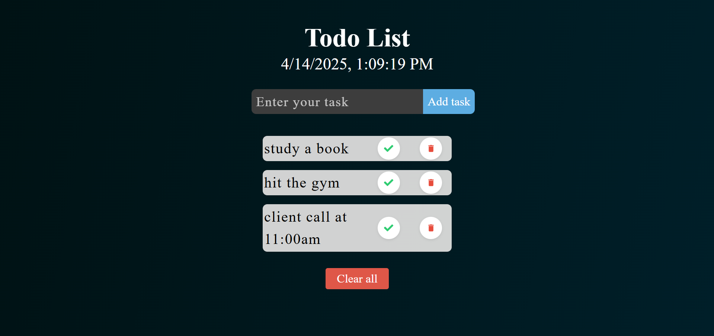

# 📝 Animated React Todo List

A beautifully styled and animated Todo List App built with **React**, featuring smooth UI interactions, real-time date-time updates, and task management functionalities.



---

## 🎯 Overview

This project is a modern Todo List App that lets you:
- Add tasks
- Mark them as complete
- Delete individual tasks
- Clear all tasks at once

With a **live date & time display** and responsive UI, it's a sleek and productive daily companion.

---

## ⚙️ Features

✅ Add new tasks  
✅ Mark tasks as completed (strikethrough animation)  
✅ Delete individual tasks  
✅ Clear all tasks  
✅ Live date & time (updates every second)  
✅ Fully responsive design  
✅ Smooth hover & click animations  
✅ Clean and readable UI with pleasant spacing & fonts

---

## 🎨 UI & Animations

- **Hover Effects**: Buttons scale and cast soft shadows on hover.
- **Strike-through Animation**: When a task is marked complete.
- **Real-time Clock**: Updates every second using `useState` and `setInterval`.
- **Input Expansion**: Slight zoom effect when focusing on the task input.
- **Buttons**: Rounded, colorful, and interactive (using subtle transitions and scaling).

---

## 🚀 Getting Started

### 1. Clone the repo

```bash
git clone https://github.com/sairaj730/todo-app.git
cd todo-app